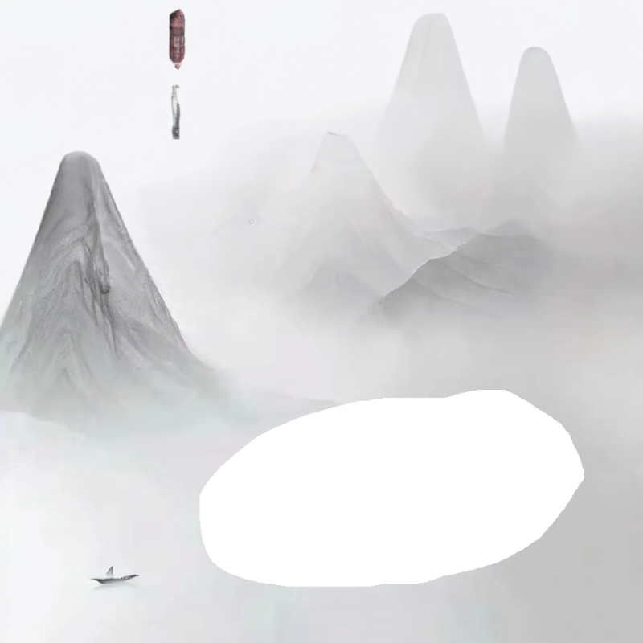

# Alpha Channel Editor

A simple front-end image editing tool focused on alpha channel (transparency) editing. Users can upload images, select specific areas, adjust the transparency of those areas, and save the edited images locally.

## Features

- Pure front-end implementation, no backend required
- Support for common image formats
- Visual area selection
- Precise transparency adjustment
- Real-time preview of edits
- Support for downloading edited images

## Usage Guide

### Technical Requirements
- Node.js 14.0 or higher
- React 18.x
- Modern web browser with HTML5 Canvas support

### Local Development
1. **Install Dependencies**
   ```bash
   npm install
   ```
   or
   ```bash
   yarn install
   ```

2. **Start Development Server**
   ```bash
   npm start
   ```
   or
   ```bash
   yarn start
   ```
   The application will be available at `http://localhost:3000`

### Basic Workflow

1. **Upload Image**
   - Click the upload button or drag and drop an image
   - Supports PNG, JPG, JPEG formats
   - 

2. **Select Area**
   - Use mouse to drag and select the area you want to edit
   - Adjust selection size and position as needed
   - 

3. **Adjust Transparency**
   - Use the slider to control transparency of selected area
   - Values range from 0 (fully transparent) to 100 (fully opaque)
   - 
4. **Save Image**
   - Click save button to download the edited image
   - Exports in PNG format to preserve transparency
   - 
